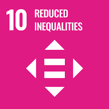
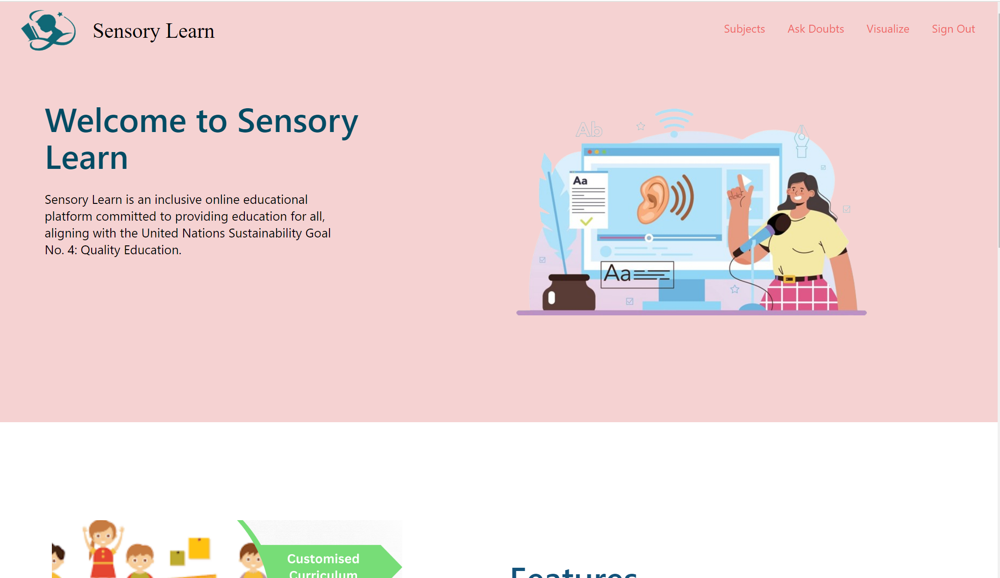
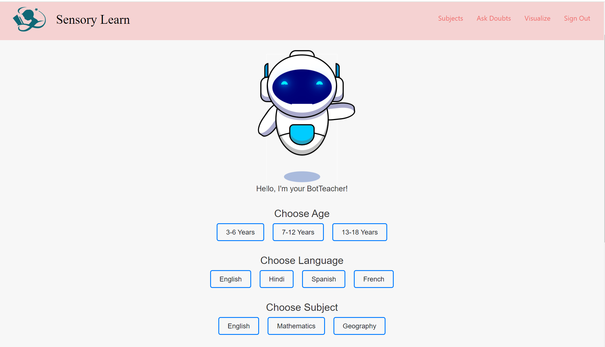
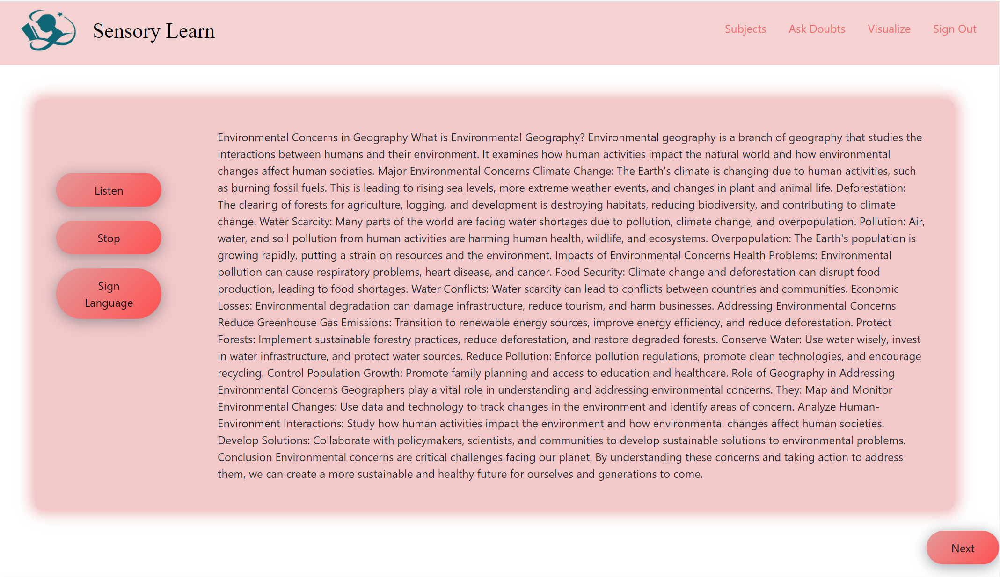
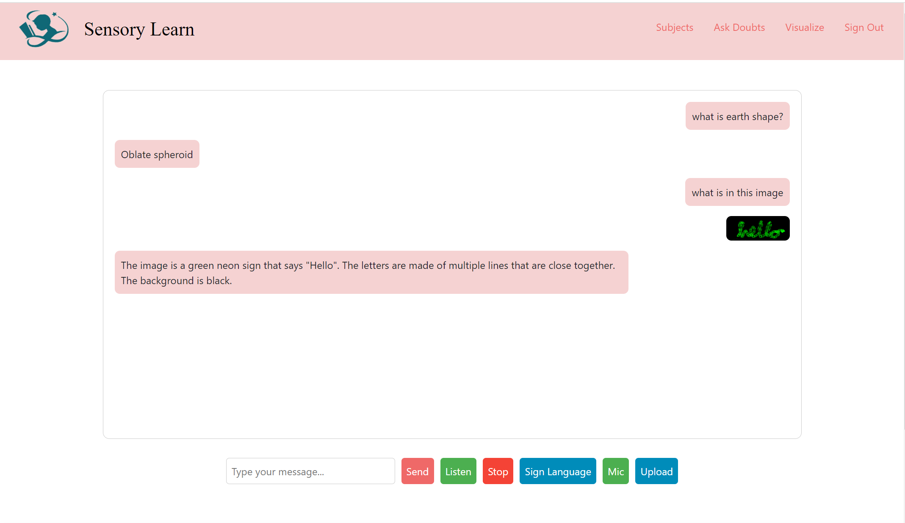

<!-- PROJECT TITLE -->
<div >
  <h1  style="bold"  >
    SENSORY LEARN
  </h1>
  
  <h3>
    A Solution Challenge 2024 Project
  </h3>
  <hr>
</div>


## Overview
Access to education is not universal, with 650+ children still out of school or lacking one-to-one learning opportunities. Sensory Learn addresses this issue as an inclusive online educational platform, committed to providing quality education for all. Aligned with the United Nations Sustainability Goals No. 4: Quality Education and Goal 10: Reduced Inequalities, Sensory Learn focuses on underprivileged children who lack access to traditional education. 

<p align="center">
  
</p>


## Sustainable Development Goals
Sensory Learn contributes to UN Sustainability Gaol "Quality Education" and "Reduced Inequalities" by providing an inclusive platform available in 40+ languages, ensures educational resources are accessible to diverse communities worldwide. Features like sign language and text-to-speech promote inclusivity, allowing everyone to learn at their own pace.The AI bot, accommodating typed, spoken, or image-based questions, further enhances inclusivity and promotes learning opportunities.
<p align="center">
  
  
</p>

## Project Overview

### Home Page- 


### Select Age, Language, and Subject- 


### Generated Content- 


### AI Bot for Doubts- 



## Project Portals
- Sensory Learn Website: [Sensory Learn](https://sensorylearn.web.app/)
- Sensory Learn Demo Video: [Watch Video](https://youtu.be/1xONfu-dQKk)


## Key features
1. Inclusive online educational platform designed for underprivileged children.
2. Available in 40+ languages, with features like sign language and text-to-speech for enhanced accessibility.
3. Customized curriculum for different age groups.
4. AI bot for answering questions, accepting typed, spoken, or image-based queries.
5. Promotes quality education and reduced inequalities by providing accessible learning opportunities.

## Google Technologies Used
<div class="flex ">
  


  
</div>

<br>

## How to Run

Follow these steps to set up and run Sensory Learn locally:

1. **Clone the Repository:**

    ```bash
    git clone https://github.com/your-username/sensory-learn.git
    cd sensory-learn
    ```

2. **Install Dependencies:**

    ```bash
    # Install backend dependencies
    pip install -r requirements.txt

    # Install frontend dependencies
    npm install
    ```

3. **Run the Application:**

    ```bash
    # Run Flask backend
    flask run

    # Run React frontend
    npm start
    ```

    The application will be accessible at `http://localhost:3000` by default.


## About us
### Team Members 
1. [Suhaani Aggarwal](https://github.com/Suhaani07/)
2. [Tejashree Bhangale](https://github.com/tejashreee03)
3. [Austin Paul](https://github.com/)

The idea for Sensory Learn originated from our recognition of the educational disparities existing worldwide. We aim to bridge the gap by providing an inclusive platform accessible to all, promoting quality education, and reducing inequalities. Our team consists of dedicated individuals: Suhaani Aggarwal, Tejashree Bhangale, and Austin Paul, who share a common goal of making education accessible for every child.
